<h1 align='center'>Tickitz Website</h1>
  <p align="center">
    <a href="https://master--tickitz-eticket.netlify.app/">View Demo</a>
    ·
    <a href="https://github.com/usergithub/namarepo/issues">Report Bug</a>
    ·
    <a href="https://github.com/usergithub/namarepo/pulls">Request Feature</a>
  </p>

<p align="center">
 <a href="https://ibb.co/cc1ThB8"></a>
</p>

## About The Project

tickitz its an app for booking ticket online, and this app is build for website user with react js. the feature of the web is
you can check movie,order seat, see schedule and booking a ticket online. this app make user can book a ticket easyly.

## Built With

[](https://github.com/react-bootstrap/react-bootstrap)
[](https://reactjs.org/)

## Requirements

1. <a href="https://nodejs.org/en/download/">Node Js</a>
2. Node_modules `npm install` or `yarn install`
3. Backend API Tickitz [`here`](https://github.com/aflahfernanda/paytickz-project)

## User Testing Account

email : mgmcqxwrvvn@knowledgemd.com
password: user123

## Admin Testing Account

email : admin@gmail.com
password: admin123

## Getting Started

1. Download this Project or you can type `git clone https://github.com/aflahfernanda/tickitz__website__frontend.git`
2. Open app's directory in CMD or Terminal
3. Type `npm install` or `yarn install`

```sh
URL_BACKEND: "https://project-paytickz.herokuapp.com/",
URL_CLOUDINARY: "https://res.cloudinary.com/da776aoko/image/upload/v1656419307/",
```

5. Type `npm run dev`

## Acknowledgements

- [axios](https://www.npmjs.com/package/axios)
- [bootstrap](https://www.npmjs.com/package/bootstrap)
- [node-sass](https://www.npmjs.com/package/node-sass)
- [qs](https://www.npmjs.com/package/qs)
- [react-redux](https://www.npmjs.com/package/react-redux)
- [redux](https://www.npmjs.com/package/redux)
- [redux-logger](https://www.npmjs.com/package/redux-logger)
- [redux-promise-middleware](https://www.npmjs.com/package/redux-promise-middleware)
- [redux-thunk](https://www.npmjs.com/package/redux-thunk)
- [eslint](https://www.npmjs.com/package/eslint)

<br>

## Contributors

If you have a suggestion that would make this better, please fork the repo and create a pull request.

1. Fork the Project
2. Create your Feature Branch
3. Commit your Changes
4. Push to the Branch
5. Open a Pull Request

## 🔎 Web Preview Pages

<h3 align='center'>Auth Preview Pages</h3>
<p float="left">
  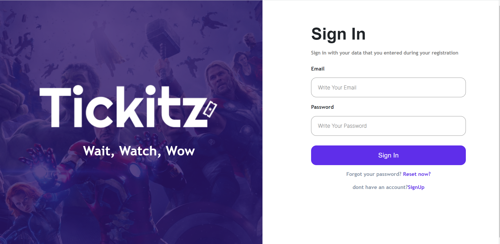
   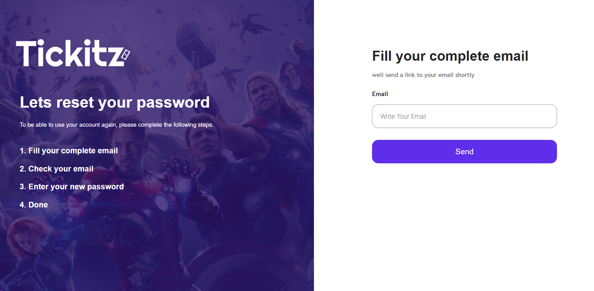
</p>
<p float="left">
  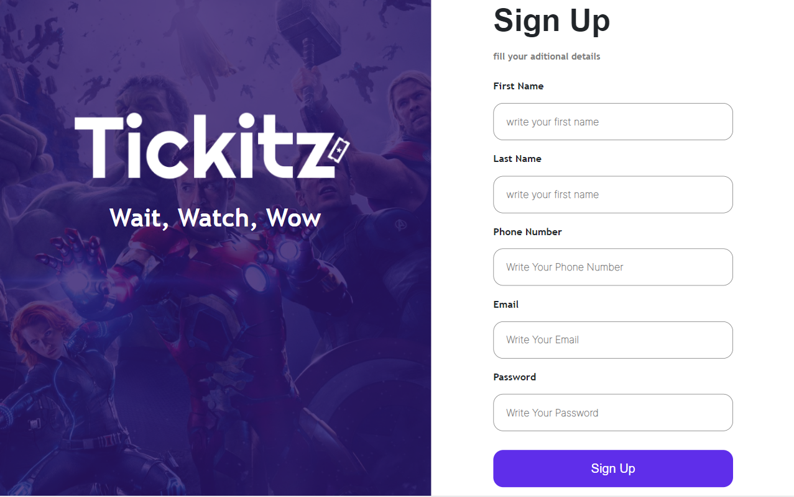
</p>
 
<br>
<h3 align='center'>User Preview Pages</h3>
<p float="left">
  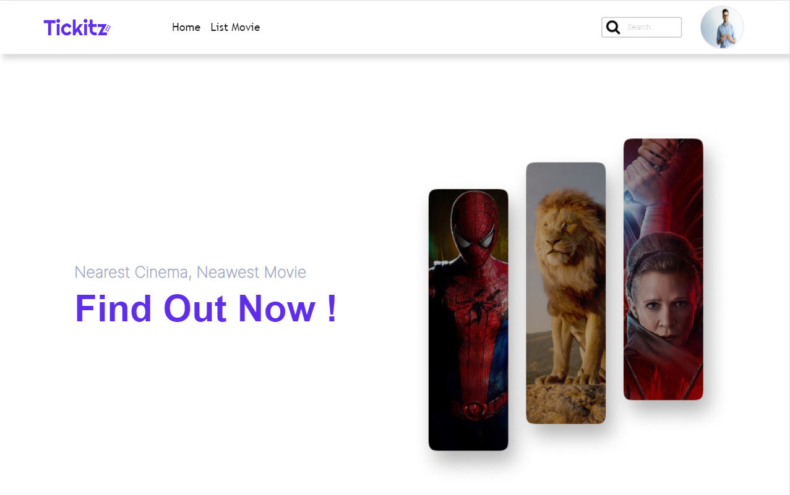
    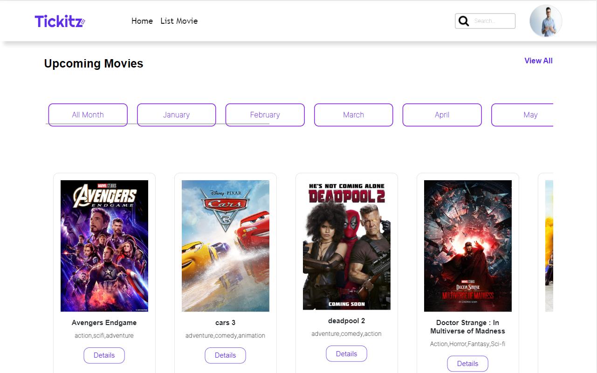
</p>
<p float="left">
  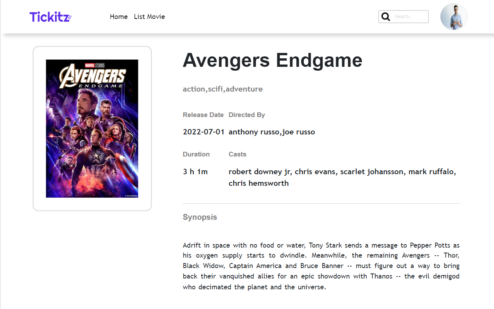
    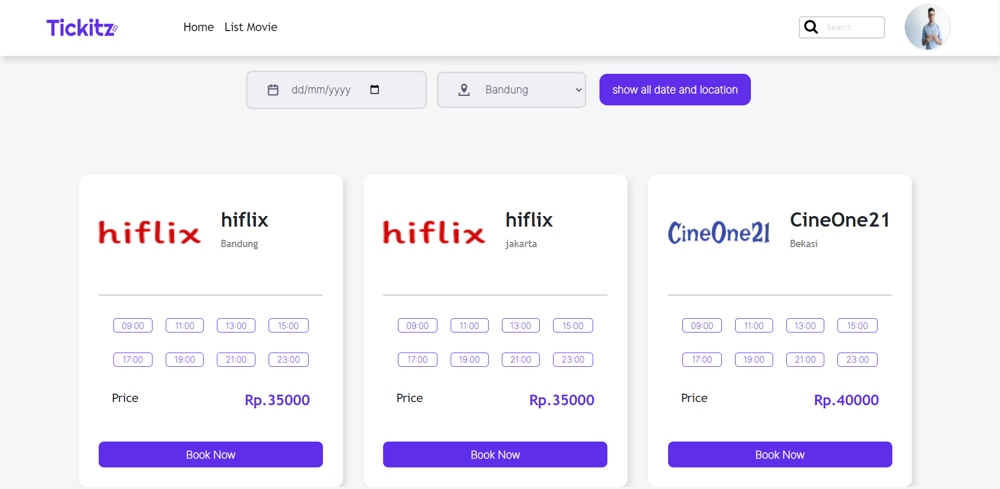
</p>
<p float="left">
  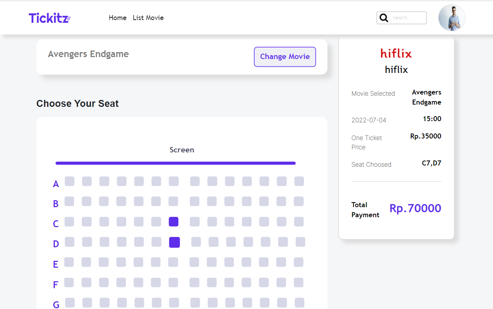
    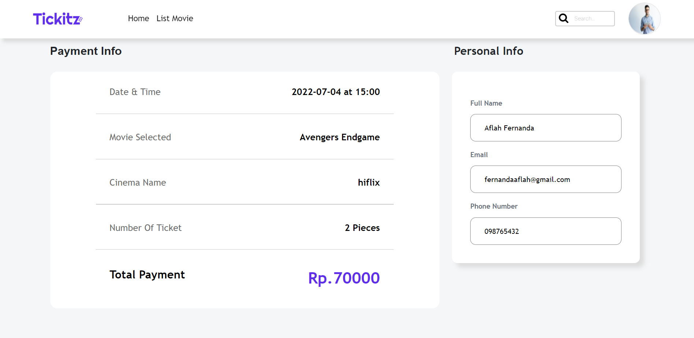
</p>
<p float="left">
  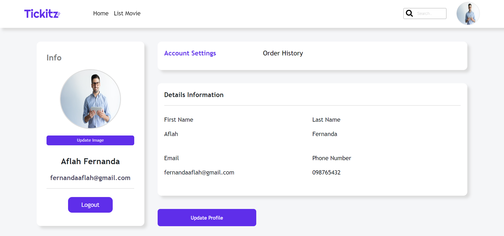
</p>
<br>
<h3 align='center'>Admin Preview Pages</h3>
<p float="left">
  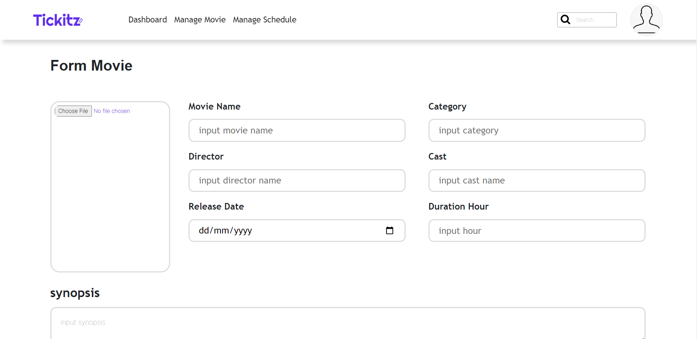
    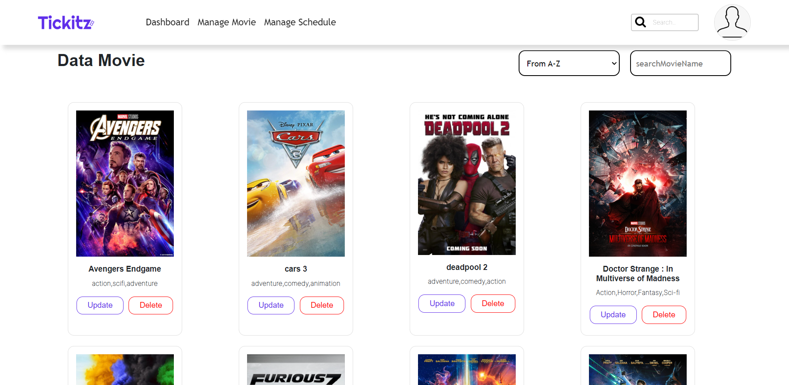
</p>
<p float="left">
  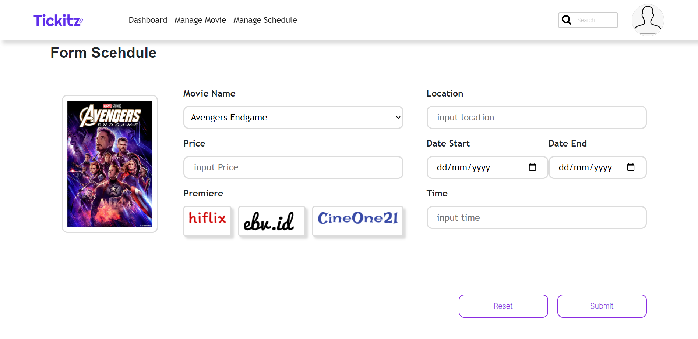
    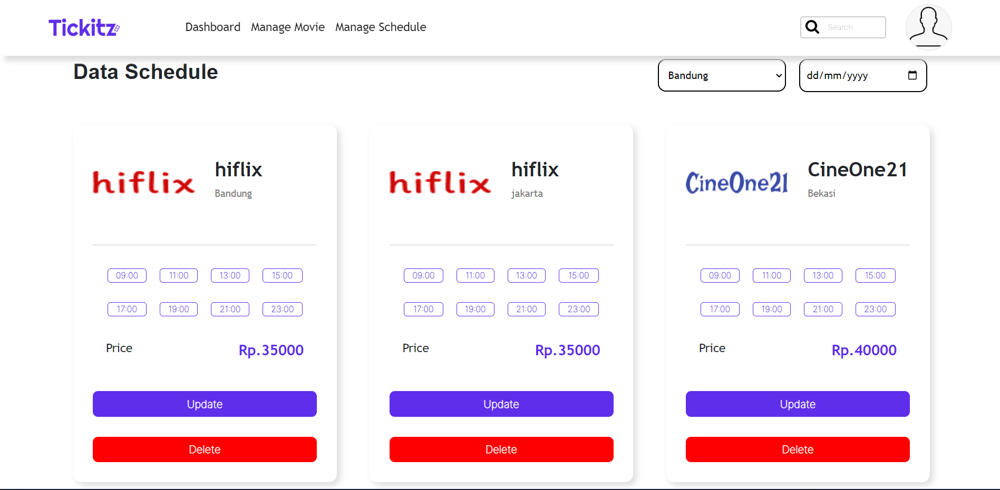
</p>
<p float="left">
  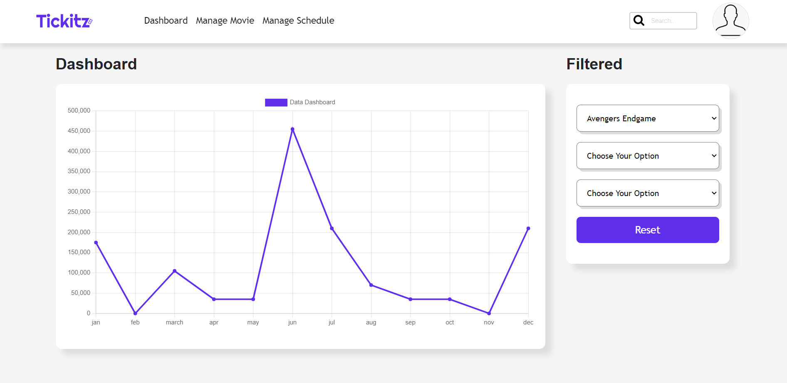
</p>

## Contact

Instagram - [@aflahfernanda](https://www.instagram.com/aflahfernanda/)
linkedIn - [@aflahfernanda](https://www.linkedin.com/in/aflah-fernanda-6841401ab/)
email-[fernandaaflah@gmail.com](fernandaaflah@gmail.com)

## License

© [Mohd.Aflah Fernanda](https://github.com/aflahfernanda)
© [Tickitz](https://github.com/aflahfernanda/tickitz__website__frontend.git)
